# Proxie App

## Description
Proxie is a social networking app designed to foster meaningful connections through location-based interactions. Leveraging Firebase for authentication, messaging, and data storage, the app features a battery-efficient real-time geolocation algorithm that redefines the way users interact. This innovative approach ensures privacy at greater distances while seamlessly notifying users as they come within proximity, striking a balance between personal safety and spontaneous connection.  


Proxie seeks to inspire users to message one another, meet in person, and engage in meaningful conversations, breaking away from the isolating trends of modern social media. By encouraging users to step away from their screens and connect face-to-face, Proxie aligns itself with the U.S. Surgeon General's call to address the epidemic of loneliness. This app is not just a tool but a statement—a vision to redirect the trajectory of technology toward fostering genuine human connection and social well-being.

---

## Technology Stack

Proxie leverages a modern technology stack to deliver a seamless and efficient user experience:

### Frontend
- **Swift (iOS)**: Native app development for smooth performance and deep integration with iOS features.
- **UIKit**: Handles the app's user interface design and interactions.

### Backend
- **Firebase Firestore**: Real-time database for storing user data, messages, and proxie events.
- **Firebase Authentication**: Secure and reliable user authentication system.
- **Firebase Cloud Functions**: Backend logic for handling asynchronous operations and notifications.
- **Firebase App Check**:Ensures that only requests originating from the Proxie app are processed by the backend, using DeviceCheck and App Attest to validate client integrity.

### APIs
- **LocationIQ API**: Provides reverse geocoding for detailed location descriptions in Proxie events.
- **CoreLocation**: Manages geolocation and proximity detection with battery-efficient tracking.

### Deployment
- **TestFlight**: Used for iOS app testing and gathering user feedback during development.

### Other Tools
- **Xcode**: Integrated development environment for app development and debugging.
- **Apple Developer Program**: Enables distribution and testing of the app on iOS devices.

---


## Features

### 1. Authentication System
- **Firebase Authentication**:
  - Login and signup functionality is fully integrated with **Firebase Authentication** for secure account management.
- **Login Screen**:
  - Allows users to sign in using their registered email and password.
  - Includes a "Don't have an account?" signup link that navigates to the account creation page.
  - "Forgot Password" button allows users to reset their password via email.

- **Signup Page**:
  - Inputs for:
    - **Username**: Displayed in-app as the user's name.
    - **Email**: Used for account recovery.
    - **Password**: Used for account security.
  - A dropdown or URL input to select a monster avatar (currently placeholder URLs, allowing users to input custom avatar links).
  - A "Sign Up" button that:
    - Creates an account using Firebase Authentication.
    - Displays a success message upon successful signup.
    - Redirects to the login screen after 5 seconds.

- **Forgot Password**:
  - Allows users to input their email and receive a password reset link via Firebase Authentication.

---

### 2. Firebase App Check
- Proxie integrates **Firebase App Check** to ensure that only legitimate requests from the Proxie app are processed by Firebase services.
- App Check uses:
  - **DeviceCheck** for iOS devices running version 14.5 or earlier.
  - **App Attest** for iOS devices running version 14.6 or later.
- This feature provides an additional security layer to:
  - Validate the authenticity of requests sent to the backend.
  - Prevent unauthorized or malicious requests, safeguarding user data and backend operations.

---

### 3. Map Screen
- Displays the user's current location and shows friends' locations if they are within a 750-foot radius.

#### Navigation Buttons:
- **Top-Right Buttons**:
  - **Picture of a Person**: Takes you to the Profile Screen.
  - **Top-Left Buttons**:
  - **Picture of a Bunch of People**: Takes you to the Friend Management Screen.
- **Bottom-Left Button**:
  - **Message Bubble Picture**: Takes you to the Chat List View.
- **Bottom-Right Button**:
  - **Trophy Button**: Takes you to the Activity Screen.
- **Arrow Button**:
  - Toggles location locking. Locks onto your location visually on the map when clicked.

#### Key Features:
- Beyond 750 feet, friends' locations are hidden.
- A notification is sent to both users when they enter the 750-foot range ("Proxied"), and their locations are shown on the map while they remain in proximity.
- **Arrow Button**: Toggles between locking onto your location and free map navigation.

---

### 4. Profile Screen
- Accessible via the **Picture of a Person** icon in the top-left corner of the map screen.
- **Features**:
  - **Edit Username**: Users can update their username, and changes persist across the app (e.g., messages, profiles).
  - **View Account Details**:
    - Displays the username.
    - Displays the account creation date.
  - **Profile Picture Placeholder**: For future implementation.
  - **Logout Button**: Signs the user out (via Firebase Authentication) and returns to the login screen.
- **Statuses**:
  - Four app-wide statuses:
    1. Willing to Talk
    2. Open to Possibilities
    3. Currently Unavailable
    4. Incognito: Hides the user's location and disables notifications, even within 750 feet.
  - Each status includes a brief description.

---

### 5. Friend Management Screen
- Accessible via the **Friends Icon** in the top-right corner of the map screen.
- Displays:
  - A list of current friends.
  - Friend requests, dynamically updated with a counter on the notification bell.
- **Features**:
  - Add friends by typing their username and clicking the "Add" button, which sends a friend request.
  - Navigate back to the main map screen using the back button.

---

### 6. Messaging System
- **Friend List**:
  - Displays all friends with message status icons:
    - Delivered but unopened.
    -Delivered but left unopened.
    - Received but unread.
    -Received but left on read.
    - No messages yet (prompt to "Say Hello").
    
- **Chat View**:
  - Displays:
    - User's messages on the right with timestamps in blue bubbles.
    - Friend's messages on the left with timestamps in grey.
    - Friend's username at the top.
    - Input field at the bottom to send new messages with send button.

---

### 7. Activity Screen
- **Log History**:
  - Records all Proxie events with details like:
    - Event description (e.g., "You proxied with W3 on 2024-11-07 17:59 near Van Ness, Market Street, Hayes Valley, San Francisco, California, 94103, USA").
    - Reverse geocoded locations (via LocationIQ API).
  - Includes a "Map View" button to display:
    - Start and end locations for each Proxie event.
    - A line connecting the locations with the distance shown below the map.
- **Active Queries**:
  - Most connected person: Displays the username.
  - Number of connections today, this week, and this month (starting at 0 by default).
  - Least often connected friend: Displays the username.
  - Longest proximity streak: Number of days and friend's username.
  - Current longest streak: Only includes ongoing streaks of 2+ days. If no streak exists, it displays "0 with nobody."

---

### 8. Geolocation Optimization for Battery Efficiency
- **Battery Concerns**:
  - Significant focus was placed on minimizing battery usage since the app continuously tracks location, even in the background or when the app is closed.
- **Efficient Geolocation Algorithm**:
  - The tracking algorithm adjusts location accuracy based on proximity:
    - For friends at far distances: Rough location data is retrieved using low-power methods (e.g., cell tower triangulation).
    - As friends move closer: Location accuracy gradually increases.
    - Within the critical 750-foot radius: GPS accuracy is optimized to within a meter to ensure precise detection.
  - This adaptive system ensures accurate proximity detection while conserving battery life.


## Database Structure
The app uses Firebase Firestore for data storage, with the following structure:

### **Users Collection**
Each user is represented as a document within the `users` collection, identified by a unique `userId`. The structure includes:

- **Fields**:
  - `username` (String): Public display name of the user.
  - `profilePictureMonster` (String): Public URL for the user's avatar.
  - `joinDate` (Timestamp): Public timestamp for when the user joined the app.
  - **`locationData`** (Protected):
    - `currentLocation` (GeoPoint): The user's current geographical location.
    - `lastUpdated` (Timestamp): Timestamp of the last location update.
  - **`privateData`** (Private):
    - `email` (String): User's email address.
    - `friends` (Array of Strings): UserIds of friends.
    - `friendRequests` (Array of Strings): UserIds of users who sent friend requests.
    - Additional private fields as necessary.

- **ProxieEvents Subcollection**:
  - Each user document contains a subcollection called `proxieEvents`, storing proximity events.
  - **Event Fields**:
    - `friendId` (String): UserId of the friend involved in the event.
    - `userId` (String): UserId of the user involved in the event.
    - `startLocation` (GeoPoint): Location where the Proxie event began.
    - `startTime` (Timestamp): Start time of the Proxie event.
    - `endLocation` (GeoPoint, Optional): Location where the Proxie event ended.
    - `endTime` (Timestamp, Optional): End time of the Proxie event.

---

### **Conversations Collection**
Each conversation is stored as a document within the `conversations` collection, identified by a unique `conversationId`.

- **Fields**:
  - `participants` (Array of Strings): UserIds of all participants in the conversation.
  - `lastMessage` (String): Content of the most recent message.
  - `lastUpdated` (Timestamp): Timestamp of the last message sent.

- **Messages Subcollection**:
  - Each conversation document contains a `messages` subcollection for storing individual messages.
  - **Message Fields**:
    - `senderId` (String): UserId of the sender.
    - `recipientId` (String, Optional for group chats): UserId of the recipient.
    - `timestamp` (Timestamp): Time the message was sent.
    - `content` (String): The message content.
    - `isRead` (Boolean): Indicates whether the message has been read.

## Testing and Deployment
- **Apple Developer Program**: This app has been developed as part of the Apple Developer Program.
- **TestFlight Testing**:
  - The app has been extensively tested on multiple iOS devices using TestFlight.
  - A total of 30 different versions have been deployed to TestFlight for testing and feedback.

---

## Visuals

### 1. Screenshots
Here are some key screens from the Proxie app:

- **Login Screen**  
  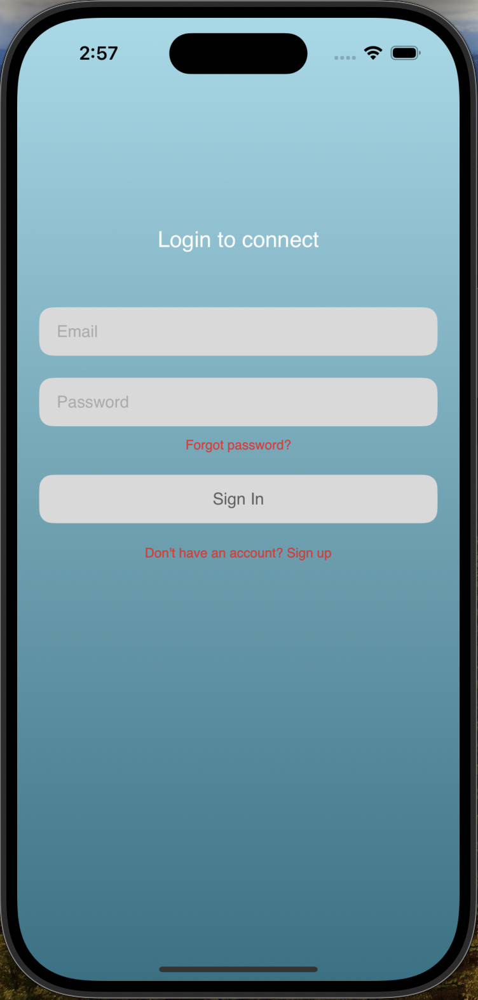

- **Main Screen**  
  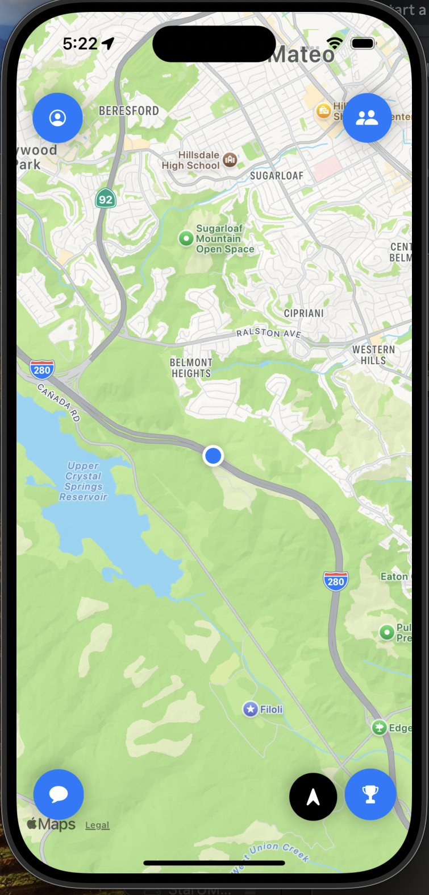

- **Profile Screen**  
  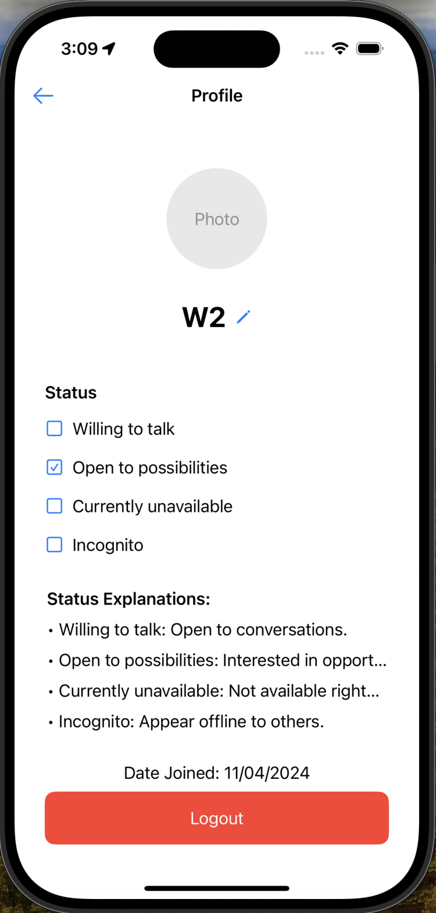

- **Sign Up Screen**  
  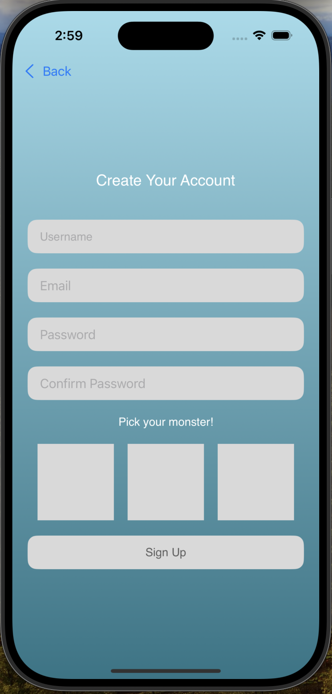

- **Friend Requests Screen**  
  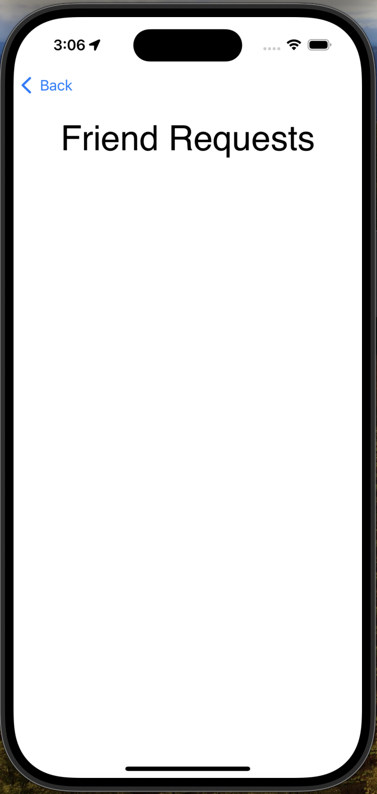

- **Individual Message Screen**  
  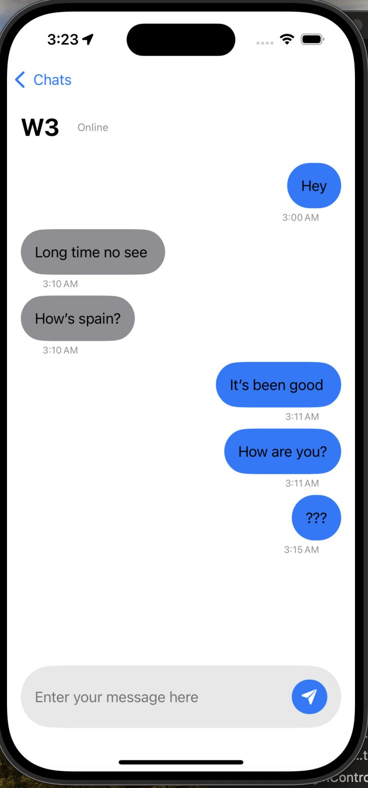

- **Friend Management Screen**  
  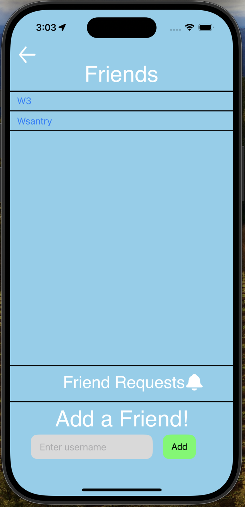

- **Forgot Password Screen**  
  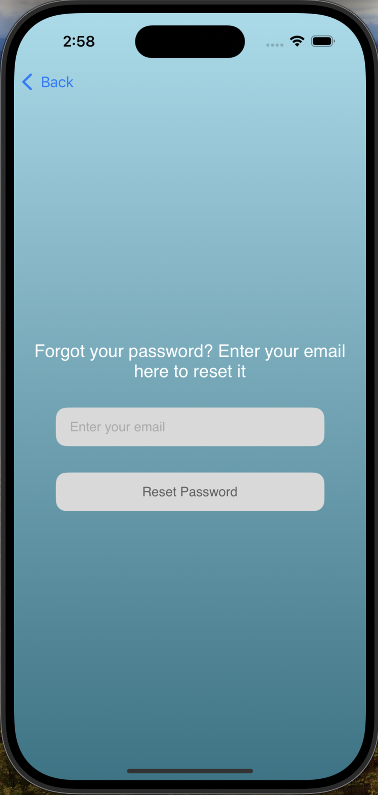

- **Diary Map Screen**  
  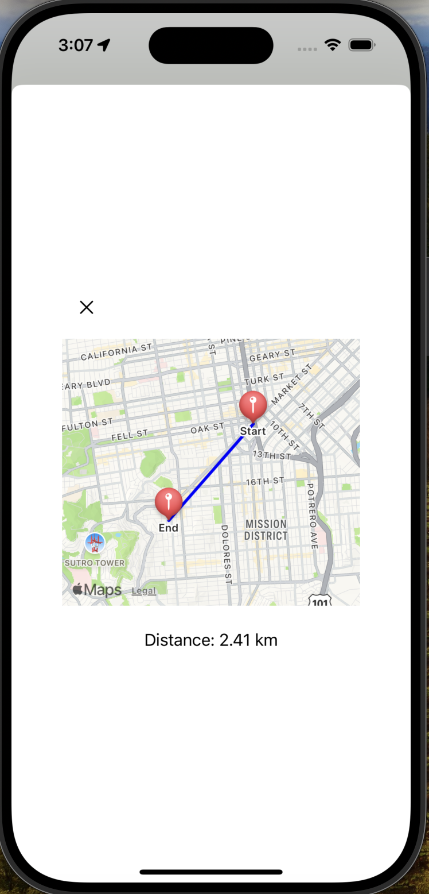

- **Chat List View**  
  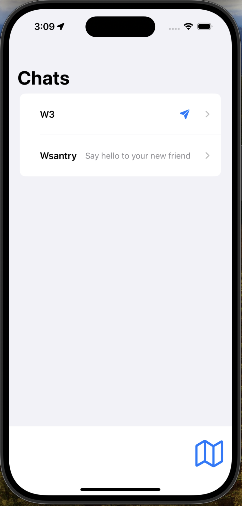

- **Activity Screen**  
  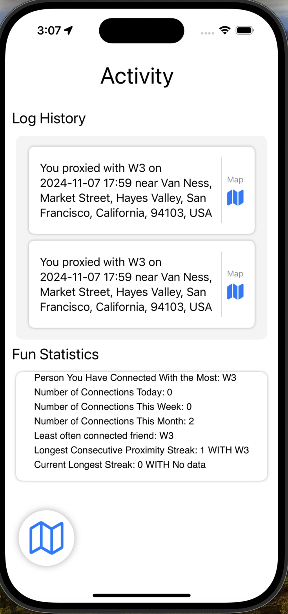
  
 - **Proximity Interaction Example 1**  
  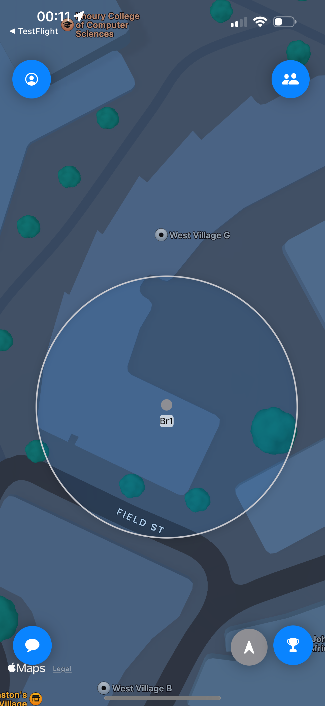
  
 - **Proximity Interaction Example 2**  
  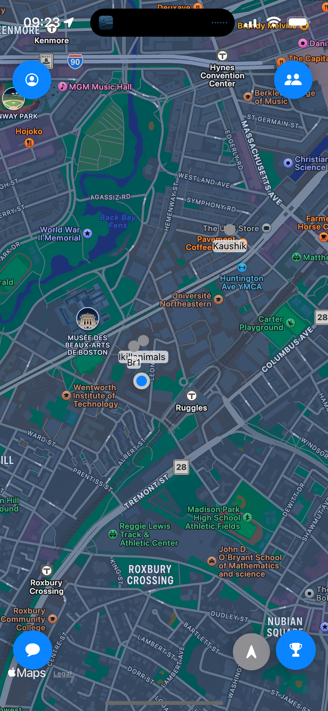
  
 - **Proximity Notifications**  
  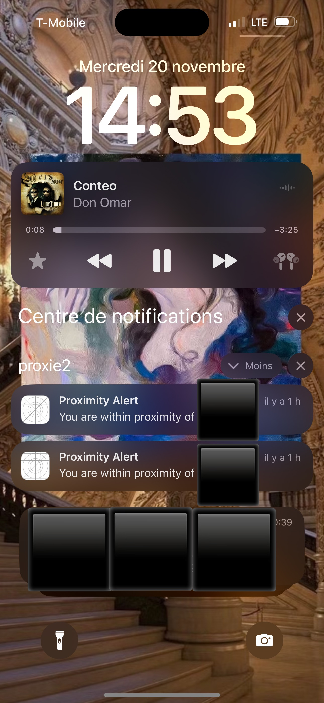
  
  
  
  
  
  

### 2.  Video Walkthrough

 Experience the Proxie app in action with this playthrough video:

 - **App Playthrough Video**


**App Playthrough Video**  
[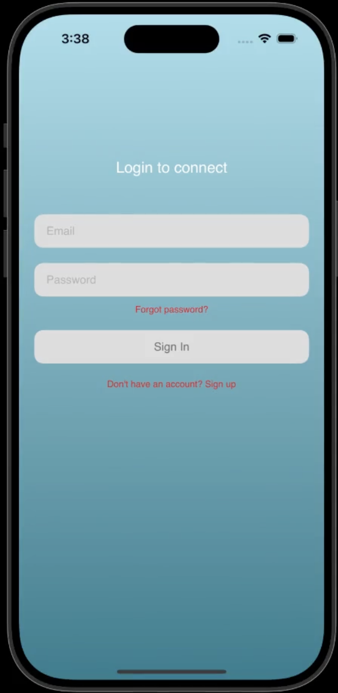](Visuals/AppPlaythroughVideo.mp4)


---

### 3. Diagrams 
Visualize the app's architecture and workflows:

- **UML Diagram**  
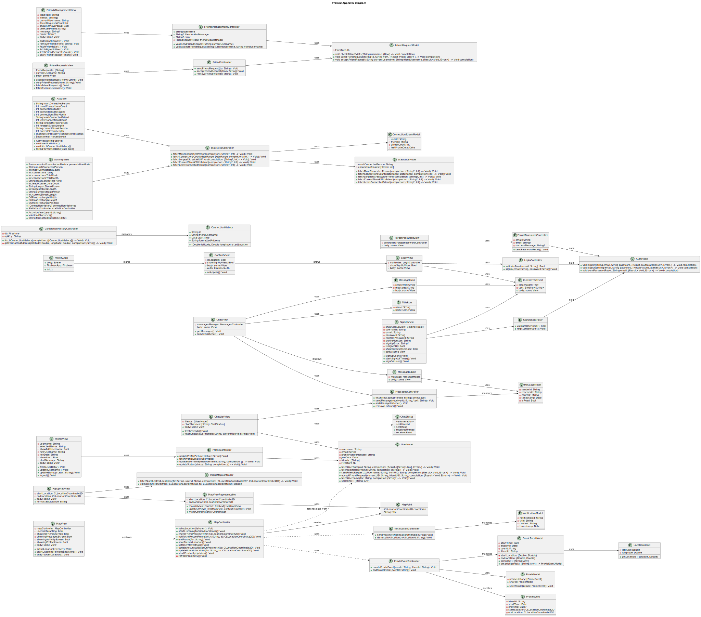


For detailed technical explanations, refer to the [Technology Stack](#technology-stack) section.

### 4. Fimga Screen Mockups 
Get an insight on the steps we took in designing the UI/UX

- **Figma Mockups**  
Link:https://www.figma.com/design/J8jHdsFllTBkoBZBIhhLwX/Untitled?node-id=0-1&t=XQRyhG6wyq1SLOu9-1


## License
This project is proprietary, and all rights are reserved. Unauthorized use, reproduction, distribution, or modification of any part of this project is strictly prohibited.

For inquiries about using this software, please contact Willem Santry at wsantry@verizon.net.

---

## Contributions
This project was created and is maintained by **Willem Santry**. Shubham Dongale(his git is ItsmeOO7) helped with mocking up Ui screens(via Figma) quite a bit and specializes in UI/UX. At this time, I am not seeking contributions or collaborators for this project.

---

## Roadmap
The next big feature planned for Proxie is the ability for users to add media—up to two photos and one video—during a Proxie event. This media will be displayed in the **Diary Logs** for that specific event. The goal is to allow users to capture spontaneous memories while respecting privacy and fostering meaningful interactions.

---

## Installation

Follow these steps to set up and run the Proxie app:

### 1. Prerequisites
Ensure your environment is ready:
- **Xcode**: Install the latest version of Xcode (minimum version supporting Swift 5.9).
- **iOS SDK**: Ensure your system supports iOS 15.0 or higher.
- **Apple Developer Account**: Required for running the app on physical devices.
- **Swift Package Manager**: Used for dependency management.

---

### 2. Clone the Repository
Start by cloning the Proxie app repository:
"```bash
git clone https://github.com/your-username/proxie-app.git
cd proxie-app"

--- 

### 3. Install Dependencies
 Proxie uses **Swift Package Manager** for managing dependencies. To install: 
1. Open the project in Xcode:
bash
   open proxie-app.xcodeproj

2. In Xcode, go to **File > Add Packages** and add the following dependencies: - [Firebase](https://github.com/firebase/firebase-ios-sdk) (Authentication, Firestore, Cloud Functions) - [Mapbox Maps SDK](https://github.com/mapbox/mapbox-maps-ios) (Custom map rendering)

--- 
 
### 4. Configure Firebase 
Set up Firebase for backend functionality:  
1. Visit the [Firebase Console](https://console.firebase.google.com/) and create a new project.  
2. Add an iOS app to the project, following Firebase's setup instructions.  
3. Download the GoogleService-Info.plist file from Firebase.  
4. Add the GoogleService-Info.plist file to the Xcode project:  
   - Drag the file into the project navigator.  
   - Ensure it is included in the app target.  

---

### 5. Configure Firebase App Check  
Enhance security by enabling Firebase App Check:  
1. In the Firebase Console, enable **App Check** for all Firebase services used by the app.  
2. Configure the app to use:  
   - **DeviceCheck** for devices running iOS 14.5 or earlier.  
   - **App Attest** for devices running iOS 14.6 or later.  
3. Add the App Check initialization code in your app:  
 "  ```swift
   import Firebase
   FirebaseApp.configure()
   AppCheck.setAppCheckProviderFactory(AppAttestProviderFactory())"


### 6. Set Up API Keys
 Proxie uses the **LocationIQ API** for reverse geocoding: 
1. Sign up for a free or premium account at [LocationIQ](https://locationiq.com/).
 2. Generate an API key in your LocationIQ dashboard. 
3. Add the API key to the app by editing the Info.plist file:
xml
   <key>LocationIQ_API_Key</key>
   <string>YOUR_API_KEY_HERE</string>


---

 ### 7. Enable App Capabilities
 Ensure the required capabilities are enabled in Xcode: 
1. Navigate to **Signing & Capabilities** in the project settings. 
2. Enable the following:
 - **Background Modes**: Check Location updates. 
 - **Push Notifications**: Ensure notifications are configured. 

---

 ### 8. Build and Run the App 
1. Select a physical device or iOS simulator in Xcode.
 2. Build and run the app:
bash
   Cmd + R
3. For testing on a physical device, make sure the appropriate provisioning profile is selected in **Signing & Capabilities**.

 --- 

### 9. Testing the App 
To test proximity features: 
- Use at least two test accounts in Firebase
 (e.g., Fakee1@gmail.com and Fake2@gmail.com with password <PASSWORD>). 
- Simulate locations using Xcode's built-in location simulation tools or test with two physical devices.
- Heavily relied on TestFlight with over 30 versions dispatched and tested 

--- 

### 10. Additional Notes
 - **Xcode Cloud**: Configure workflows for deployment to TestFlight or the App Store.
 - **App Identifier**: Use com.Santry.proxie2 for signing and provisioning. ---


## Closing Note

Thank you for taking the time to explore this project! I hope you found it informative and engaging. If you have any questions, feedback, or suggestions, feel free to reach out at wsantry@verizon.net.

Happy coding! 🚀
